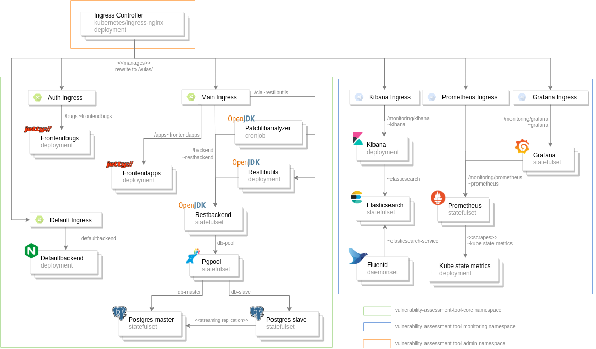

# Vulnerability assessment tool helm chart

This readme is meant to give an overall view of the Eclipse Steady deployment to a Kubernetes cluster and does not go into detail about helm chart values.
For more detailed configuration see:
-   [vulnerability-assessment-tool-core chart](vulnerability-assessment-tool-core/README.md)
-   [vulnerability-assessment-tool-admin chart](vulnerability-assessment-tool-admin/README.md)
-   [vulnerability-assessment-tool-monitoring chart](vulnerability-assessment-tool-monitoring/README.md)

# Overall Architecture



This repository contains three subcharts which are meant to be installed independently from each other:
-   **vulnerability-assessment-tool-core**: which encapsulates all the core components of the tool including:  
  - *frontendapps*: Jetty web UI which allows submitting code for review
  - *frontendbugs*: Jetty web UI which allows admins to manage bugs database
  - *patchlibanalyzer*: CronJob which analyzes code submitted
  - *restbackend*: Springboot backend which communicates with postgres
  - *restlibutils*: Springboot backend which provides extra utilities
  - *database*: HA Postgresql Vulnerability database

-   **vulnerability-assessment-tool-admin**: which encapsulates all the cluster admin tools
  - *nginx-ingress*: NGINX ingress controller used to expose the service
  - (future releases) *redis*: A caching server for NGINX

- **vulnerability-assessment-tool-monitoring**: which is used to deploy the dedicated monitoring stack
  - *elastic*: Elasticsearch + Kibana stack
  - *fluentd*: Log collection daemonset
  - *grafana*: Metrics graphing
  - *prometheus*: Metrics collector + exporters


# Vulnerability-assessment-tool Core
This chart comprises of 6 subcharts and represents the tool's core architecture.

## Frontendapps and Frontendbugs
These two are Jetty Web servers written in SAP-UI5 which allows for submitting code for review (frontendapps serving on the path `/apps`) and for administering bugs database (frontendbugs serving on the path `/bugs`) . It uses Ajax requests to communicate with other components in the architecture (mainly the restbackend). Due to the fact that computing in this component is delegated to the client, it has a really light footprint and can function with minimal resources such as:
```yaml
resources:
  limits:
    memory: "200Mi"
    cpu: "200m"
  requests:
    memory: "100Mi"
    cpu: "100m"
```

For more information see the [frontendbugs chart](vulnerability-assessment-tool-core/charts/frontendbugs) and [frontendapps chart](vulnerability-assessment-tool-core/charts/frontendapps)

## Patchlibanalyzer
A Java application which runs constantly in order to analyze packages for vulnerable constructs. It can be run as a Kubernetes managed cronjob by disabling (`deployment.enabled=false`) or as a standalone self managed cronjob by enabling (`deployment.enabled=true`). This component communicates directly with both the restbackend (configured through the environment variable **vulas.shared.backend.serviceUrl**) and the restlibutils (configured through the environment variable **vulas.shared.backend.serviceUrl**)

For more information see the [patchlibanalyzer chart](vulnerability-assessment-tool-core/charts/patchlibanalyzer)

## Restbackend
A springboot backend which communicates with the Postgres database through **hibernate** (see [docs](https://hibernate.org/)) and the infrastructure's cornerstone. The connection is direct and the host can be configured through the env variable **spring.datasource.url** (which has to be a jdbc syntax compliant string).

Since the schema is bound to change over time, the restbackend also has a **flyway** module (see [docs](https://flywaydb.org/)) which allow for on the fly schema migration. This connection is also direct and can be configured with the env variable **FLYWAY_URL** (also a jdbc syntax compliant string).

Since queries and calls are both numerous and complex, this component requires a lot of resources. In production, with a data load of about 300GB, the recommended resources are:
```yaml
resources:
  limits:
    memory: "16Gi"
    cpu: "8"
  requests:
    memory: "8Gi"
    cpu: "4"
```

For more information see the [restbackend chart](vulnerability-assessment-tool-core/charts/restbackend)

## Restlibutils
A springboot backend which is used by the restbackend and patchlibanalyzer to perform construct analysis. As this is the component in charge of the analysis, it is also recommended to allocated it quite a lot of resources, such as:
```yaml
resources:
  limits:
    memory: "15Gi"
    cpu: "7"
  requests:
    memory: "8Gi"
    cpu: "2"
```

For more information see the [restlibutils chart](vulnerability-assessment-tool-core/charts/restlibutils)

## Postgres

The database storing all data related to the vulnerability-assessment-tool. For high availability as well as performance, this chart implements a master-slave replication cluster for postgres. The replication method (see [postgres HA docs](https://www.postgresql.org/docs/current/high-availability.html)) can be summed up by the graph below:


-   i) The init container in the postgres replica pod uses pg_basebackup pointed to the postgres master container. This command copies the data from the master node to make sure that the replica is up to date, then creates the `replica.conf` file which tells the replica node that it is the master's standby.
-   ii) Once the pg_basebackup succeeds, it allows for the postgres replica container to spin up, mounting the same PVC as the init container (thus sharing the data + config)
-   iii) The replica nodes frequently queries the master to ask for the most recent WAL segment. This gets writen if the master has updates (Insert/ update queries).
-   iv) The master sends the most recent WAL segments to the slave, thus ensuring replication.

This replication method presents one main issue: **the read and write streams have to be separate to ensure data consistency**, therefore, you can't write into replica nodes. This is where **pgpool** comes in and acts as a buffer to distinguish read from write requests and proxy them accordingly.

For more information see the [database chart](vulnerability-assessment-tool-core/charts/database)


# Vulnerability-assessment-tool Admin
This chart contains only a single nginx-ingress subchart configured to serve vulnerability assessment tool core components. It will however include a redis subchart to serve as a distributed caching db for nginx.
For more information see the [nginx-ingress chart](vulnerability-assessment-tool-admin/charts/nginx-ingress)

# Vulnerability-assessment-tool Monitoring
This chart contains a logging and monitoring stack for the vulnerability-assessment-tool core cluster. It contains 4 subcharts:
-   *elastic* : contains elasticsearch + kibana, used for storing and visualising logs
-   *fluentd* : log fetcher for the logging stack
-   *prometheus*: contains node exporter (for exporting node related metrics, kube-state-metrics for cluster wide metrics and prom-server for the actual prometheus server)
-   *grafana*: graphing for monitoring stack


---
# Contributing
See [Contributing](docs/Contributing.md)
