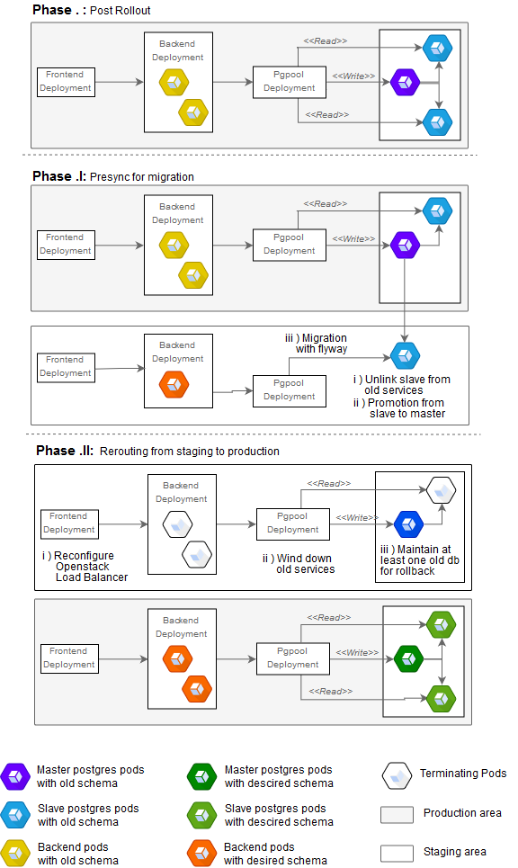

# Handling schema changes

This guide is destined to help migrating versions with schema changes without hiccups. This assumes all three charts have been installed independently within their designated namespaces with the core chart having major release name : `alpha` migrating towards major release `beta`.


## TL;DR

This upgrade can be automated using the utils packaged with this chart (which can be installed by following this [guide](BuildingUtils.md)). You can run the following command, once the module is built:

```sh
utils upgrade --kubeconfig={ kubeconfig } \
                    --coreNamespace={ coreNamespace } \
                    --adminNamespace={ adminNamespace } \
                    --currentRelease={ currentRelease } \
                    --futureRelease={ futureRelease }

# for more info and flags
utils upgrade --help
```

Once the new release has been properly spun up and tested, you can use the utils package to automatically update the admin chart to point at the newest release with:

```sh
utils route --kubeconfig={ kubeconfig } \
                  --coreNamespace={ coreNamespace } \
                  --coreRelease={ coreRelease } \
                  --adminNamespace={ adminNamespace } \
                  --adminRelease={ adminRelease }


# for more info and flags
utils route --help
```


## Detailed actions



The Golang migrator utils uses the given `kubeconfig` to communicate directly with the cluster's Kubernetes API through the Kubernetes Go-client. And does the following actions (see previous image):

-   Fetches the replicas amount of the postgres slave statefulset within the cluster
-   Scales down one replicas if possible which will be promoted to master in the future release
-   Gets the PVC associated with the pod that's getting scaled down
-   Creates an ephemeral Job that mounts said PVC and deletes recovery.conf
-   Uses helm to create a new release named `beta` with **.Values.database.postgres.master.existingClaims** = Name of old PVC. This spins up a whole new core chart and allows the restbackend to apply schema changes without threatening data loss due to failure (as the `alpha` release is still present) and at a very quick pace (data already mounted, no need to create and copy new PVC).
-   Once the user validates the new release's viability, uses helm to upgrade the admin chart to serve release `beta`.

*Note*: During the migration, both releases can coexist without an issue

*Note*: the monitoring chart does not get affected due to it being agnostic to releases and the modification on the admin chart affects only ingresses, thus, allowing for switching in less then 15s.


## Rollback

Rolling back to a previous release (assuming you have not deleted the `alpha` chart) can be done with the following commands:

```console
# Services should be back to normal, serving old release straight away
$ helm rollback `$ADMIN_CHART`

# Free up resources by delete new release
$ helm delete `$BETA_CORE_CHART`
```
